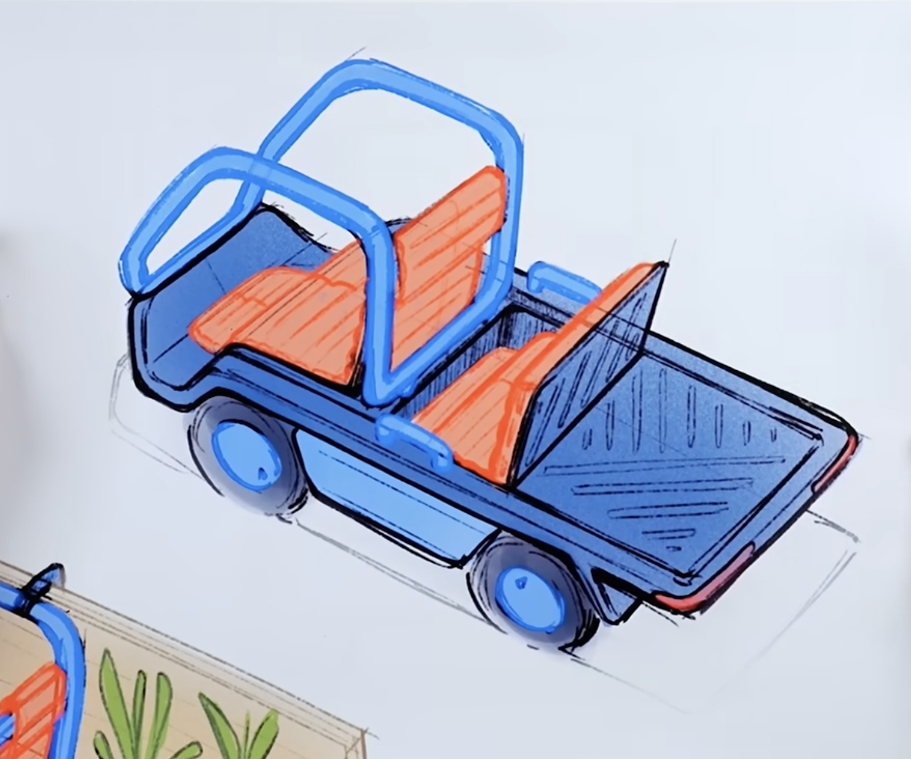

# Open Kei Truck

Open Kei Truck is an early-stage open-source project to define a compact, American kei-truck-style electric utility vehicle around accessible parts, repeatable fabrication, and evidence-backed subsystem choices.



## What This Repo Is

This repository is the public working notebook for the first technical package: battery candidates, whole-vehicle component sourcing, traction voltage assumptions, supplier verification, and high-voltage safety requirements. It is intentionally pack-agnostic. The goal is to define a battery envelope and interface spec before the chassis is frozen around any one supplier.

## Current Reference Target

| Area | Target |
|---|---|
| Use case | Local utility, light commercial, community prototype |
| Battery energy | 35-55 kWh usable target |
| Chemistry | LFP / LiFePO4 preferred |
| Traction bus | 300-430 V operating window |
| Battery output | >=60 kW continuous, >=120 kW peak |
| Battery integration | Integrated BMS, contactors, fuse, precharge, HVIL, isolation monitoring, CAN, and liquid cooling preferred |
| Motor reference | Bosch SMG180 OHW is a reference target, not a locked motor; practical consumer sourcing is Fiat 500e salvage, not Bosch direct |

Battery voltage, inverter limits, charger behavior, and motor selection must be validated as one system. A promising pack is not considered verified until the project has the datasheet, supplier quote, CAD/package file, and integration documentation.

## Start Here

1. Read [Project Scope](docs/00-project-scope.md).
2. Review the battery targets in [Battery Requirements](docs/03-battery-requirements.md).
3. Inspect [data/battery-candidates.csv](data/battery-candidates.csv), the source of truth for battery comparison data.
4. Open the generated [Battery Shortlist](docs/04-battery-shortlist.md).
5. Review the whole-truck sourcing map in [Whole-Vehicle Parts List](docs/07-whole-vehicle-parts-list.md) and [data/component-candidates.csv](data/component-candidates.csv).
6. Check the ADRs in [decisions/](decisions/) before changing a target or assumption.

## Repository Map

| Path | Purpose |
|---|---|
| `data/` | Structured CSV matrices and status vocabulary |
| `docs/` | Living requirements, notes, shortlist, and next steps |
| `decisions/` | Architecture Decision Records for project-level choices |
| `safety/` | High-voltage safety architecture notes and checklists |
| `suppliers/` | Quote templates and supplier follow-up material |
| `scripts/` | CSV validation and generated Markdown tooling |
| `.github/ISSUE_TEMPLATE/` | Markdown issue templates for contributors |

## Key Google Docs

GitHub is the source of truth for tracked requirements, decisions, and data. Google Docs can hold drafts, long-form notes, and working discussion.

| Document | Purpose |
|---|---|
| [Open Kei Truck working doc](https://docs.google.com/document/d/1TnJtOqWYKVURaYV2c_4Uqg8voKTuFQYaCqHaaYgHtW8/edit?usp=sharing) | Shared project notes and planning draft |

## Data Workflow

Keep `data/battery-candidates.csv` as the source of truth. Unknown values should be written as `UKN`, not left blank. Status values are defined in [data/status-vocabulary.md](data/status-vocabulary.md).

Keep `data/component-candidates.csv` as the whole-vehicle component sourcing matrix. It tracks supplier links, sourcing strategy, status, and the open questions for every major assembly.

Run validation:

```sh
python3 scripts/validate_battery_candidates.py
python3 scripts/validate_component_candidates.py
```

Regenerate the shortlist table after editing the CSV:

```sh
python3 scripts/generate_battery_shortlist.py
```

Check that generated Markdown is current:

```sh
python3 scripts/generate_battery_shortlist.py --check
```

## Contributing

Use GitHub issues to propose battery candidates, supplier quote updates, and design decisions. Supplier claims should stay marked as unverified until evidence is attached or linked. See [CONTRIBUTING.md](CONTRIBUTING.md) for the working rules.

## License

This project is licensed under the Apache License 2.0. See [LICENSE](LICENSE).
